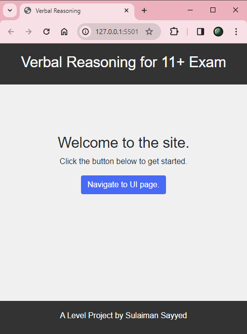

## A level project called Verbal Reasoning for 11+ Exam

- This file contains the steps taken to build this project. 
- Git is used to commit each step.
- Once I have done enough practice of creating html files and adding CSS and java scripts along with using Bootstrap-5. The main project started on Wednesday 14th February 2024.
- As I intend to use Bootsrtap5 locally I have downloaded the minified version of it.

### Software tools used to code 

- Vscode is used for coding, to display the site locally an extension named [Live Server](https://marketplace.visualstudio.com/items?itemName=ritwickdey.LiveServer) is used written by Ritwick Dey. Other pre installed microsoft extension are also used to take help in writing and formatting html,CSS.
- A free software [PickPick](https://picpick.app/en/) is also used to capture the images.
- Microsoft Windows Terminal is used to interact with `git` running powershell version 7.4.0.


### Step 1:

- The main folder is called `A-level-Project`.
- Where this `Readme.md` file is created. It is a markdown file  and git is initialised in this directory using `git init .`
- The `.` denotes the current folder.
- At this stage no commit exist and nothing has been staged.
- Once this is added, it is first staged using `git add -A .` it staged all files present in current folder.
- When log is taken of the commit it shows the following.
  
```txt
commit 14bf41b805feb441ed62d52a3cfaca8258996393 (HEAD -> main)
Author: SulaimanSayyed <Sullisayyed21@outlook.com>
Date:   Wed Feb 14 14:13:53 2024 +0000

    Initial Commit: Readme.md added for A level project
```
> First commit is done.

### Step 2:

- A folder structure is created to keep files separate and organised shown below.
  
```
K:.
└───resources
    ├───bootstrap-5.0.2
    │   ├───css
    │   └───js
    ├───custom-css
    ├───data
    └───sounds
```

- Placed bootstrap minified css and js files into corresponding folders.
- Also created `custom.css` for customising the style sheet besides bootstrap.
- For writing javascript code initially `script-1.js` is created.
- Data folder has a JSON file named `opposites.json` It contains only two questions. Thy are kept in JSON objects and values are kept in an array using bracket notations `[ ]`.
- Two sound files are used to denote the success or failure, they are kept in sounds folder.
- Following is the state of this project folder, `tree /F` command is used to get using microsoft terminal with `powershell 7.4.0`.

```
K:.
│   ReadMe.md
│
└───resources
    ├───bootstrap-5.0.2
    │   ├───css
    │   │       bootstrap.bundle.min.js
    │   │       bootstrap.min.css
    │   │
    │   └───js
    ├───custom-css
    │       styles.css
    │
    ├───data
    │       opposites.json
    │
    ├───scripts
    │       script-1.js
    │
    └───sounds
            buzz.wav
            success.wav
```
  
> Second commit is done

- There were some mistakes found in Readme.Md file so another additional two commits are being done.

    
---


### Step 3:

- Entry point for the site `index.html` is created and placed in root folder.
- A new folder `images` is created where snapshots of the app or websites are saved. This folder is not part of the website but kept for keeping the record of the website visual state.
- Following is the state of the `index.html`

```html
<!DOCTYPE html>
<html lang="en">

<head>
    <meta charset="UTF-8">
    <meta name="viewport" content="width=device-width, initial-scale=1.0">
    <title>Verbal Reasoning</title>
    <!-- Link to local Bootstrap CSS -->
    <link rel="stylesheet" href="./resources/bootstrap-5.0.2/css/bootstrap.min.css">
    <!-- Link to Custom CSS -->
    <link rel="stylesheet" href="./resources/custom-css/styles.css">
</head>

<body>

    <header>
        <h1>Verbal Reasoning for 11+ Exam</h1>
    </header>

    <!-- Landing Page Section -->
    <main id="landing-page" class="container-fluid main-custom">
        <h1>Welcome to the site.</h1>
        <p>Click the button below to get started.</p>
        <button id="start-btn" class="btn btn-primary">Navigate to UI page.</button>
    </main>

    <footer id="main-footer" class="footer">
        <small>A Level Project by Sulaiman Sayyed</small>
    </footer>
    <!-- Link to JavaScript file -->
    <script src="./resources/scripts/script-1.js"></script>
    <script src="./resources/bootstrap-5.0.2/js/bootstrap.bundle.min.js"></script>
</body>

</html>
```

- This is the first snap shot of the website.
  


- **What is present in index.html file**
- It is the entry point for the website and simply consist of three section 
  1. Header Html tag providing the header at the top of the page.
  2. Landing Page section that includes `<main>` html tag enclosing heading, paragraph and single button html elements.
  3. Footer element contains text enclosed in `<small>` html tag.
- All these three sections are helped by CSS styles using ids and classes. This style sheet is present in custom-css folder and named styles.css.
- Following is the state of `style.css`.
  
```css
body {
    font-family: Arial, sans-serif;
    background-color: #f0f0f0;
    margin: 0;
    padding: 0;
}

header {
    background-color: #333;
    color: #fff;
    padding: 20px;
    text-align: center;
   
}

.footer {
    background-color: #333;
    color: #fff;
    padding: 20px;
    text-align: center;
    position: fixed;
    bottom: 0; 
    width: 100%;
}

.main-custom {
    text-align: center;
    margin-top: 100px;
}
```

> Fifth commit is done ( the third and fourth were only done to correct some typo)


---

## Adding second page


### Step 4

- A new file `mainui.html` is added, it presents available practices to the user.
- User interface is divided into two bootstrap columns which are kept in one row as shown in the html code.
- Button elements are used to display the choices.
- A new file `mainui.css` is created to control the styles. Though it could have been written in the same style.css, but to keep everything separate and easy to understand a new file is used.
- To implement the logic of navigating to this page when button is pressed from the index.html, code is written in `script-1.js`.
- When the button with id `start-btn` is clicked it navigates to the mainui.html consequently the next page is shown. This logic is shown below.
  
```js 
// Get the reference to the  button element
const startButton = document.getElementById('start-btn');

// Attach an event listener to the button
startButton.addEventListener('click', function() {
    // Redirect to the next page
    document.location.href = 'mainui.html';
});
```

- **Code Analysis**
- Though JavaScript is not an object oriented language by design yet it provides concepts to create objects and access its properties and methods using dot `.` notation which is common in most object oriented language like C++.
- JavaScript has the ability to access the DOM ( document object model) which is available to modern browser like chrome,to access html elements along with its fields. The `document` object in above code points to the html file loaded.
- When a method is to be selected by its object or an instance of the class, it is done by using a dot notation. Thus to do any work with html tags or elements, it first needs to be referenced, it is often knows as having a handel to the object. And to do so `getElementById()` method of the `document` object  is used. The method `getElementById()` takes an argument which is provided with an unique id `start-btn` that belong to a button that controls the navigation to the other page.
- Once its reference is acquired, it is saved in a variable identifier named `startButton` of type `const`.
- The reason it is done so that an event listener can be attached to this button. Once the event listener is attached, we can write the logic for this button to take action.
-  The logic  is to assign a value to `href` which points to a file name `mainui.html` using the `document` object then selecting its property `location`. Though location is a property of the `document` object but itself is an object which is present in `document` object as a property. In turn `location` property `href` is used to assign a value.
